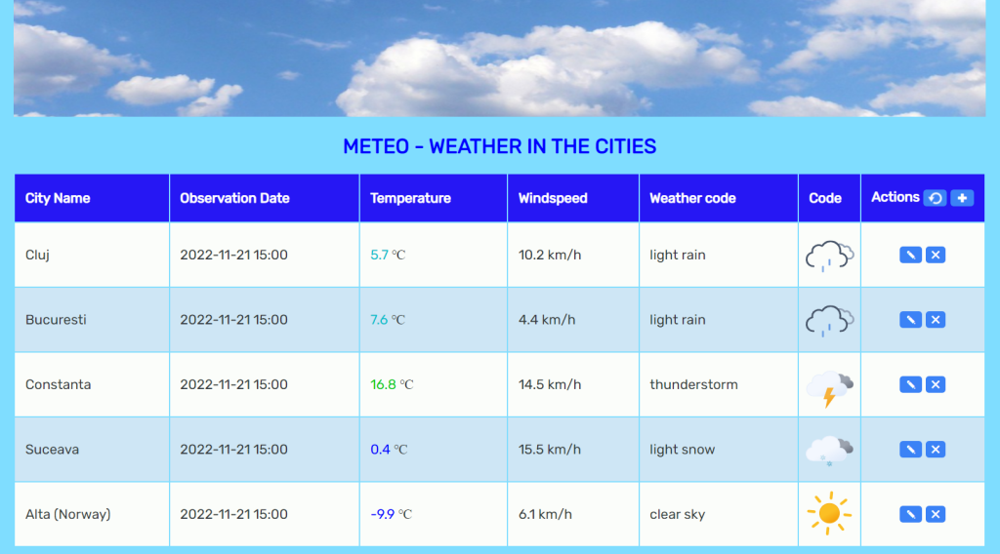

# Meteo

Weather app

## Team

- [Aurelian Constantin](https://github.com/aurelian2020)
- [Mihaela Constantin](https://github.com/mihaelacon)

## Live

[Live](https://aurelian2020.github.io/meteo/)

## Steps / Implementation history

- [x] Create a table in html
- [x] Table headers: City Name, Observation Date, Temperature, Humidity, WindSpeed, Actions
- [x] Add a json file with Cities
- [x] Design and structures in CSS
- [x] Add actions buttons
- [x] Get weather conditions (on demand)
- [x] Add/Edit/Delete locations/cities
- [x] Get current location (option)
- [x] Save data in LocalStorage
- [x] Added weather SVG icons
- [x] Colored temperature values
